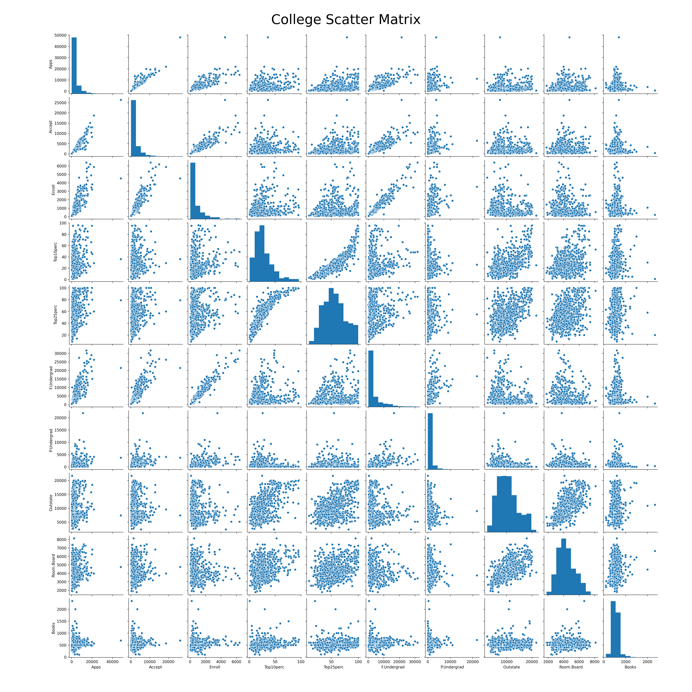
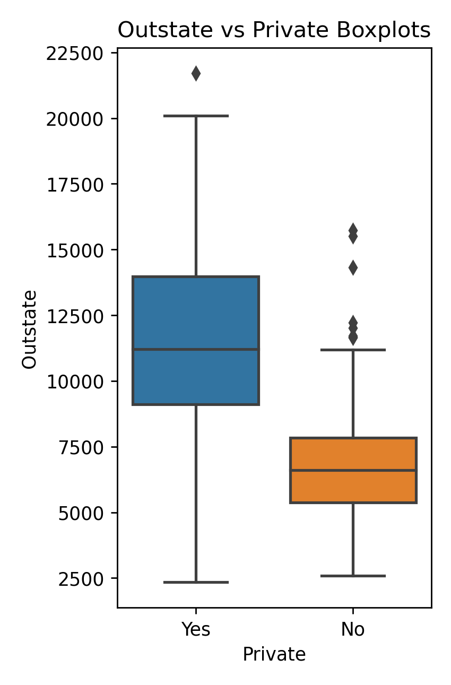
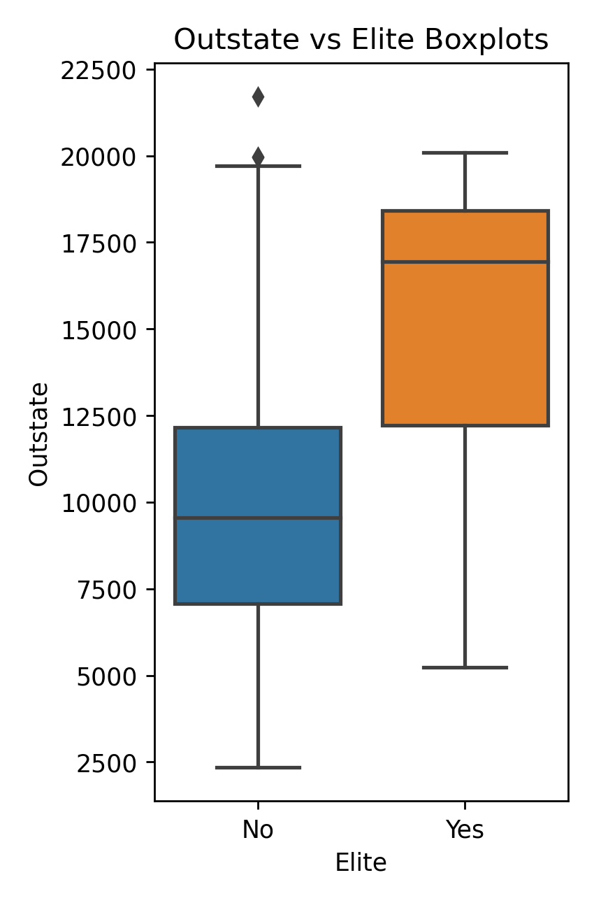

# Chapter 2 Applied Problems
```python
import pandas as pd
import numpy as np

import matplotlib.pyplot as plt
import seaborn as sns

import os
```
## Problem Eight
### Part a)
Using pandas we can load the data:
```python
college_df = pd.read_csv(os.path.join(DATA_DIR, 'college.csv'))
```

### Part b)
Index the dataframe so that college names are the index:
```python
## Set the column index to the College name
college_df.rename(columns={college_df.columns[0] : "College"}, inplace=True)
college_df.set_index("College", inplace=True)
```

### Part c)
#### i.
Numerical summary of the college data:
```python
print(college_df.describe())
```

```
               Apps        Accept       Enroll   Top10perc   Top25perc   F.Undergrad   P.Undergrad  ...     Personal         PhD    Terminal   S.F.Ratio  perc.alumni        Expend  Grad.Rate
count    777.000000    777.000000   777.000000  777.000000  777.000000    777.000000    777.000000  ...   777.000000  777.000000  777.000000  777.000000   777.000000    777.000000  777.00000
mean    3001.638353   2018.804376   779.972973   27.558559   55.796654   3699.907336    855.298584  ...  1340.642214   72.660232   79.702703   14.089704    22.743887   9660.171171   65.46332
std     3870.201484   2451.113971   929.176190   17.640364   19.804778   4850.420531   1522.431887  ...   677.071454   16.328155   14.722359    3.958349    12.391801   5221.768440   17.17771
min       81.000000     72.000000    35.000000    1.000000    9.000000    139.000000      1.000000  ...   250.000000    8.000000   24.000000    2.500000     0.000000   3186.000000   10.00000
25%      776.000000    604.000000   242.000000   15.000000   41.000000    992.000000     95.000000  ...   850.000000   62.000000   71.000000   11.500000    13.000000   6751.000000   53.00000
50%     1558.000000   1110.000000   434.000000   23.000000   54.000000   1707.000000    353.000000  ...  1200.000000   75.000000   82.000000   13.600000    21.000000   8377.000000   65.00000
75%     3624.000000   2424.000000   902.000000   35.000000   69.000000   4005.000000    967.000000  ...  1700.000000   85.000000   92.000000   16.500000    31.000000  10830.000000   78.00000
max    48094.000000  26330.000000  6392.000000   96.000000  100.000000  31643.000000  21836.000000  ...  6800.000000  103.000000  100.000000   39.800000    64.000000  56233.000000  118.00000
```
#### ii.
Plotting the scatter matrix of the first 11 columns using seaborn,
```python
## Plot the scatter matrix of the first 11 numerical columns
ax1 = sns.pairplot(college_df[college_df.columns[0:11]])
plt.gcf().subplots_adjust(bottom=0.05, left=0.1, top=0.95, right=0.95)
ax1.fig.suptitle('College Scatter Matrix', fontsize=35)
```



#### iii.
Produce the boxplots of the `Outstate` vs `Private`
```python
fig, ax = plt.subplots()
sns.boxplot(ax=ax, x="Private", y="Outstate", data=college_df)
plt.title(r'Outstate vs Private Boxplots')
width = 3.403
height = 1.518*width
fig.set_size_inches(width, height)
fig.tight_layout()
# plt.savefig(os.path.join(IMAGE_DIR,'Outstate_Private_boxplot.png'), format='png', dpi=250)
plt.show()
plt.close()
```



#### iv.
Create the new column with pandas:
```python
college_df['Elite'] = pd.Series(len(college_df['Top10perc']), index=college_df.index)
college_df['Elite'] = 'No'
college_df.loc[college_df['Top10perc']>50,'Elite'] = 'Yes'
num_elite = college_df[college_df['Elite'] == 'Yes']['Elite'].count()
```
Plot the boxplot of `Outstate` vs `Elite`
```python
fig, ax = plt.subplots()
sns.boxplot(ax=ax, x="Elite", y="Outstate", data=college_df)
plt.title(r'Outstate vs Elite Boxplots')
width = 3.403
height = 1.518*width
fig.set_size_inches(width, height)
fig.tight_layout()
# plt.savefig(os.path.join(IMAGE_DIR,'Outstate_Elite_boxplot.png'), format='png', dpi=250)
plt.show()
plt.close()
```



## Problem Nine
### Part a)
```python
## Import auto.csv from DATA_DIR
auto_df = pd.read_csv(os.path.join(DATA_DIR, 'auto.csv'))

## Print out missing values
print(auto_df.isna().sum())
print(auto_df.describe())


### a) Print out qualitative and quantitative columns
numeric_types = ['int16', 'int32', 'int64', 'float16', 'float32', 'float64']
object_types = ['object']
quantitative = auto_df.select_dtypes(include=numeric_types).columns
qualitative = auto_df.select_dtypes(include=object_types).columns
# print("All features : " + str(auto_df.columns.format()))
print("Quantitative features: " + str(quantitative.format()))
print("Qualitative features: " + str(qualitative.format()))
```

```
Quantitative features: ['mpg', 'cylinders', 'displacement', 'weight', 'acceleration', 'year', 'origin']
Qualitative features: ['horsepower', 'name']
```
Here horsepower has been classified as qualitatife due to a single value only. This will need to be processed to properly classify the column.

### Part b)
```python
for feature in quantitative:
    print(feature + ' range: ' + str(auto_df[feature].describe()['min']) + ' to ' +              str(auto_df[feature].describe()['max']))
```

```
mpg range: 9.0 to 46.6
cylinders range: 3.0 to 8.0
displacement range: 68.0 to 455.0
weight range: 1613.0 to 5140.0
acceleration range: 8.0 to 24.8
year range: 70.0 to 82.0
origin range: 1.0 to 3.0
```

### Part c)
```python
for feature in quantitative:
    print(feature + ' mean: ' + str(round(auto_df[feature].describe()['mean'], 2)) + ' , std. dev.: ' + str(round(auto_df[feature].describe()['std'], 2)))
```

```
mpg mean: 23.52 , std. dev.: 7.83
cylinders mean: 5.46 , std. dev.: 1.7
displacement mean: 193.53 , std. dev.: 104.38
weight mean: 2970.26 , std. dev.: 847.9
acceleration mean: 15.56 , std. dev.: 2.75
year mean: 75.99 , std. dev.: 3.69
origin mean: 1.57 , std. dev.: 0.8
```

### Part d)
```python
auto_dropped = auto_df.drop(auto_df.index[10:86])
# print(auto_dropped)
for feature in quantitative:
    print(feature + ' range: ' + str(auto_dropped[feature].describe()['min']) + ' to ' +              str(auto_dropped[feature].describe()['max']))
for feature in quantitative:
    print(feature + ' mean: ' + str(round(auto_dropped[feature].describe()['mean'], 2)) + ' , std. dev.: ' + str(round(auto_dropped[feature].describe()['std'], 2)))
```

```
mpg range: 11.0 to 46.6
cylinders range: 3.0 to 8.0
displacement range: 68.0 to 455.0
weight range: 1649.0 to 4997.0
acceleration range: 8.5 to 24.8
year range: 70.0 to 82.0
origin range: 1.0 to 3.0
mpg mean: 24.44 , std. dev.: 7.9
cylinders mean: 5.37 , std. dev.: 1.65
displacement mean: 187.17 , std. dev.: 99.86
weight mean: 2933.18 , std. dev.: 809.64
acceleration mean: 15.71 , std. dev.: 2.71
year mean: 77.14 , std. dev.: 3.13
origin mean: 1.6 , std. dev.: 0.82
```
