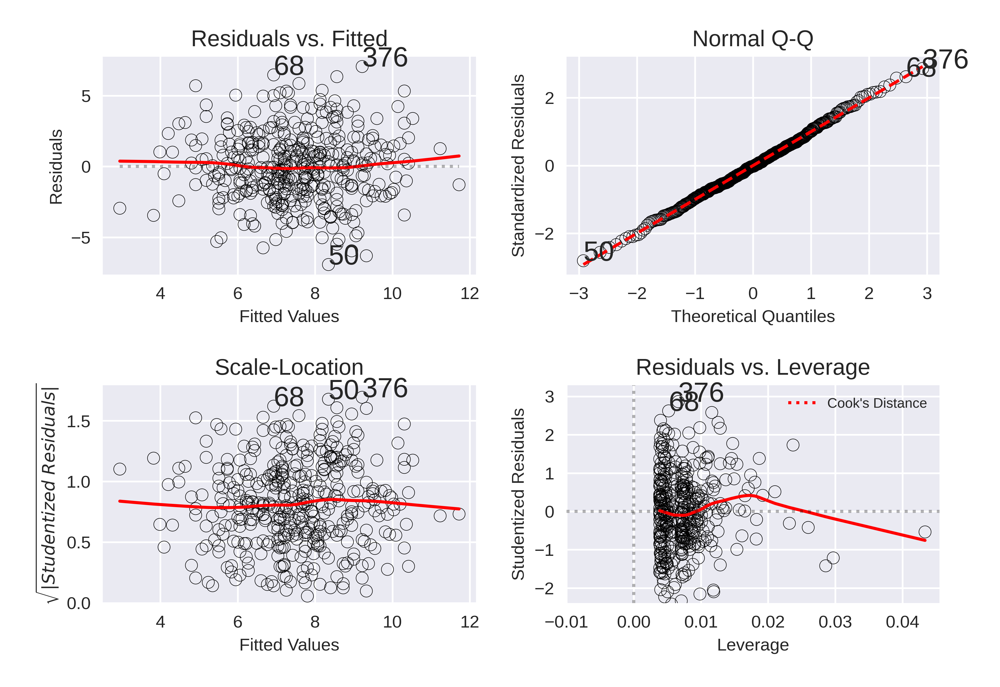

# Applied problems from

## Problem 8
SCRIPT: chap3_q8_script.py
a) Using the python script for linear regression produces the following plot:

b)

c)

## Problem 9
SCRIPT: chap3_q9_script.py

a) scatterplot

b) correlation matrix

c)
OLS Regression Results
==============================================================================
Dep. Variable:                    mpg   R-squared:                       0.821
Model:                            OLS   Adj. R-squared:                  0.818
Method:                 Least Squares   F-statistic:                     252.4
Date:                Tue, 10 Mar 2020   Prob (F-statistic):          2.04e-139
Time:                        12:42:00   Log-Likelihood:                -1023.5
No. Observations:                 392   AIC:                             2063.
Df Residuals:                     384   BIC:                             2095.
Df Model:                           7
Covariance Type:            nonrobust
================================================================================
coef    std err          t      P>|t|      [0.025      0.975]
--------------------------------------------------------------------------------
Intercept      -17.2184      4.644     -3.707      0.000     -26.350      -8.087
cylinders       -0.4934      0.323     -1.526      0.128      -1.129       0.142
displacement     0.0199      0.008      2.647      0.008       0.005       0.035
horsepower      -0.0170      0.014     -1.230      0.220      -0.044       0.010
weight          -0.0065      0.001     -9.929      0.000      -0.008      -0.005
acceleration     0.0806      0.099      0.815      0.415      -0.114       0.275
year             0.7508      0.051     14.729      0.000       0.651       0.851
origin           1.4261      0.278      5.127      0.000       0.879       1.973
==============================================================================
Omnibus:                       31.906   Durbin-Watson:                   1.309
Prob(Omnibus):                  0.000   Jarque-Bera (JB):               53.100
Skew:                           0.529   Prob(JB):                     2.95e-12
Kurtosis:                       4.460   Cond. No.                     8.59e+04
==============================================================================

Warnings:
[1] Standard Errors assume that the covariance matrix of the errors is correctly specified.
[2] The condition number is large, 8.59e+04. This might indicate that there are
strong multicollinearity or other numerical problems.

d)

10.
a.                            OLS Regression Results                            
==============================================================================
Dep. Variable:                  Sales   R-squared:                       0.239
Model:                            OLS   Adj. R-squared:                  0.234
Method:                 Least Squares   F-statistic:                     41.52
Date:                Sun, 15 Mar 2020   Prob (F-statistic):           2.39e-23
Time:                        09:35:24   Log-Likelihood:                -927.66
No. Observations:                 400   AIC:                             1863.
Df Residuals:                     396   BIC:                             1879.
Df Model:                           3                                         
Covariance Type:            nonrobust                                         
================================================================================
                   coef    std err          t      P>|t|      [0.025      0.975]
--------------------------------------------------------------------------------
Intercept       13.0435      0.651     20.036      0.000      11.764      14.323
Urban[T.Yes]    -0.0219      0.272     -0.081      0.936      -0.556       0.512
US[T.Yes]        1.2006      0.259      4.635      0.000       0.691       1.710
Price           -0.0545      0.005    -10.389      0.000      -0.065      -0.044
==============================================================================
Omnibus:                        0.676   Durbin-Watson:                   1.912
Prob(Omnibus):                  0.713   Jarque-Bera (JB):                0.758
Skew:                           0.093   Prob(JB):                        0.684
Kurtosis:                       2.897   Cond. No.                         628.
==============================================================================

b. Intercept: Self explanatory
$\beta_{Price}$: For all other variables remaining constant, an increase in price of a single unit (dollar) results in an average decrease in unit sales of 0.0545.
$\beta_{Urban}$: For all other variables remaining constant, an urban state will decrease the average sales by 0.0219. However this result is statistically insignificant.
$\beta_{US}$: For all other variables remaining constant, a US state will increase the average sales by 1.2.

c. $Y= \beta_{0} + \beta_{Price}X_{Price} + \beta_{US}X_{US} + \beta_{Urban}X_{Urban}$
where $X_{i}=[0,1]$ for Yes and no respectively. THis will result in 4 separate equations based on the values of the qualitative variables.

d. The Urban coefficient has a large P value and therefore is statistically insignificant.

e.                             OLS Regression Results                            
==============================================================================
Dep. Variable:                  Sales   R-squared:                       0.239
Model:                            OLS   Adj. R-squared:                  0.235
Method:                 Least Squares   F-statistic:                     62.43
Date:                Sun, 15 Mar 2020   Prob (F-statistic):           2.66e-24
Time:                        09:54:31   Log-Likelihood:                -927.66
No. Observations:                 400   AIC:                             1861.
Df Residuals:                     397   BIC:                             1873.
Df Model:                           2                                         
Covariance Type:            nonrobust                                         
==============================================================================
                 coef    std err          t      P>|t|      [0.025      0.975]
------------------------------------------------------------------------------
Intercept     13.0308      0.631     20.652      0.000      11.790      14.271
US[T.Yes]      1.1996      0.258      4.641      0.000       0.692       1.708
Price         -0.0545      0.005    -10.416      0.000      -0.065      -0.044
==============================================================================
Omnibus:                        0.666   Durbin-Watson:                   1.912
Prob(Omnibus):                  0.717   Jarque-Bera (JB):                0.749
Skew:                           0.092   Prob(JB):                        0.688
Kurtosis:                       2.895   Cond. No.                         607.
==============================================================================

f. Both models do not fit the data well at all based on the summary statistics.
* The low $R^2$ values suggest that there is a significant amount of unexplained variance in the moodels.
* The small value of the $F-$ statistic suggests there is not a significant relationship between the Price and the sets of predictors in either model. While the revised model is slightly better it is not sufficient to declare it a good model.

g. The confidence intervals for the coefficients are in the summaries presented above.

h.  The Diagnostic plots for the second model are:

From the plots we can conclude several things about the second model.
* **No outliers**. From the Residual plots we can see that there are no significant outliers
* **No High Leverage Point**: From the leverage plot there are no points outside of the cook lines and therefore- no points of hgh leverage.
* **Normal distribution of errors**: From the residual QQ plot the residual errors follow a normal distribution.
* **heteroscedasticity**: We see there is no trend in the absolute value of the residuals and therefore there is no trend in the error of the model.

11.
a.                                  OLS Regression Results                                
=======================================================================================
Dep. Variable:                      y   R-squared (uncentered):                   0.814
Model:                            OLS   Adj. R-squared (uncentered):              0.812
Method:                 Least Squares   F-statistic:                              434.3
Date:                Sun, 15 Mar 2020   Prob (F-statistic):                    5.57e-38
Time:                        12:03:48   Log-Likelihood:                         -139.20
No. Observations:                 100   AIC:                                      280.4
Df Residuals:                      99   BIC:                                      283.0
Df Model:                           1                                                  
Covariance Type:            nonrobust                                                  
==============================================================================
                 coef    std err          t      P>|t|      [0.025      0.975]
------------------------------------------------------------------------------
x              1.9162      0.092     20.840      0.000       1.734       2.099
==============================================================================
Omnibus:                        0.147   Durbin-Watson:                   1.908
Prob(Omnibus):                  0.929   Jarque-Bera (JB):                0.014
Skew:                          -0.028   Prob(JB):                        0.993
Kurtosis:                       3.019   Cond. No.                         1.00
==============================================================================

These results suggest (obviosly) that the x coefficient is statistically significant.

b.                             OLS Regression Results                            
==============================================================================
Dep. Variable:                      y   R-squared:                       0.802
Model:                            OLS   Adj. R-squared:                  0.800
Method:                 Least Squares   F-statistic:                     396.3
Date:                Sun, 15 Mar 2020   Prob (F-statistic):           3.29e-36
Time:                        11:54:30   Log-Likelihood:                -138.14
No. Observations:                 100   AIC:                             280.3
Df Residuals:                      98   BIC:                             285.5
Df Model:                           1                                         
Covariance Type:            nonrobust                                         
==============================================================================
                 coef    std err          t      P>|t|      [0.025      0.975]
------------------------------------------------------------------------------
Intercept     -0.0110      0.098     -0.113      0.910      -0.205       0.183
x              1.8604      0.093     19.907      0.000       1.675       2.046
==============================================================================
Omnibus:                        1.723   Durbin-Watson:                   2.013
Prob(Omnibus):                  0.422   Jarque-Bera (JB):                1.248
Skew:                          -0.005   Prob(JB):                        0.536
Kurtosis:                       3.547   Cond. No.                         1.12
==============================================================================

We see that with an intercept the x-coefficient is still statistically significant as expected.

c. Both plots are very closely related. This is because the intercept, when included, is relatively small.

15. 
