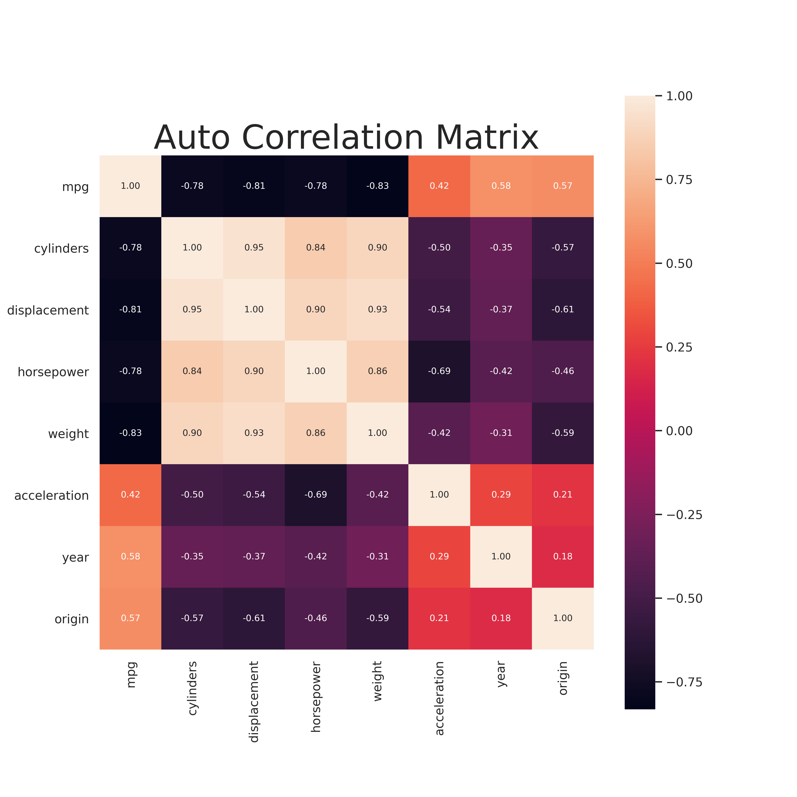

# Applied problems from

Load the Directories
```python
BASE_DIR = os.path.dirname(os.path.dirname(os.path.abspath(__file__)))
DATA_DIR = os.path.join(BASE_DIR, 'Data')
IMAGE_DIR = os.path.join(os.path.join(BASE_DIR, 'Images'), 'Chapter3')
```

## Problem 8
### a) Simple Linear Regression

Load the 'auto' data

```python
auto_df = pd.read_csv(os.path.join(DATA_DIR, 'auto.csv'))
```

As the `horsepower` column has some non numerical values we need to deal with them before any modelling.

```python
auto_df['horsepower'] = pd.to_numeric(auto_df['horsepower'], errors='coerce')
auto_df['mpg'] = pd.to_numeric(auto_df['mpg'], errors='coerce')
auto_df.dropna(subset= ['horsepower', 'mpg',], inplace=True)
```

As we are concerned about the statistical significance of the predictor so we will use statsmodels rather than sklearn to construct the linear model.

```python
## Set the target and predictors
X = auto_df['horsepower']
y = auto_df['mpg']

## Output statistical summary using statsmodels
results = smf.ols('mpg ~ horsepower', data=auto_df).fit()
```

The results of the simple linear fit are,

```
                            OLS Regression Results
==============================================================================
Dep. Variable:                    mpg   R-squared:                       0.606
Model:                            OLS   Adj. R-squared:                  0.605
Method:                 Least Squares   F-statistic:                     599.7
Date:                Tue, 31 Mar 2020   Prob (F-statistic):           7.03e-81
Time:                        10:22:20   Log-Likelihood:                -1178.7
No. Observations:                 392   AIC:                             2361.
Df Residuals:                     390   BIC:                             2369.
Df Model:                           1
Covariance Type:            nonrobust
==============================================================================
                coef    std err          t      P>|t|      [0.025      0.975]
------------------------------------------------------------------------------
Intercept     39.9359      0.717     55.660      0.000      38.525      41.347
horsepower    -0.1578      0.006    -24.489      0.000      -0.171      -0.145
==============================================================================
Omnibus:                       16.432   Durbin-Watson:                   0.920
Prob(Omnibus):                  0.000   Jarque-Bera (JB):               17.305
Skew:                           0.492   Prob(JB):                     0.000175
Kurtosis:                       3.299   Cond. No.                         322.
==============================================================================

```

From these results we can make the following conclusions:

**i.** There is a statistically significant relationship between the horsepower of a car and its mpg.

**ii.** The strength of the relationship is hard to quantify without other variables to compare to. What we can say is that, on average, an increase in one horsepower results in the decrese of 0.1578 mpg.

**iii.** There is a negative relationship between the horsepower and mpg (as expected.)

**iv.** Statsmodels linear plot conveniently produces the 95% confidence interval in the results. It is [-0.171, -0.145]mpg/hp.

### b) Linear plot
 Using the python script for linear regression produces the following plot:


From this plot we can see the negative relationship between `horsepower` and `mpg` however it seems that a linear relationship is not the best fit. An exponential decay may be better. A relationship of the form,

\[
mpg = A\exp(-\beta*horsepower) + shift
\]

### c) Diagnostic plots

The Diagnostic plots were generated with a python code from https://towardsdatascience.com/going-from-r-to-python-linear-regression-diagnostic-plots-144d1c4aa5a

The code is available in the acompanying script.

The Diagnostic plots of the simple linear fit above are:


From the diagnostic plots we see a few issues with the linear model:
##### Residuals vs. Fitted
* Ideally there should be no relationship between the residuals and the fitted values. However we see a clear trend, similar to a parabola. This may be due to the true relatinship being aexponential as discussed in the previous part.

##### Normal Q-Q
* The Normal Q-Q plot does not indictate a large degree of variing variance of the data which is a good signal.

##### Scale-Location
* THis is similar to the residuals plot and can tell us about the the heteroscedasticity (similar to the Q-Q plot). Here we can see that there is a degree of non-linearity and the varaince dows increase for the larger fitted values.

##### Leverage plot
* As there are no points outside the Cook's distance line (not even visible on the plot) we can confirm that there are no high leverage points to be discraded.

##### Outliers

From the Diagnostic plots we can see that there are some points which are consistent outliers. The most obvious outlier is point 333 which does not even follow the residual trend and should definitely be discarded. Two outher candidates are points 322 and 329. However, while these are outliers with the current regression they do lie in areas of out highly variant points. Therefore they might not be such significant outliers when using another combination of variables (For example, the exponential of the predictor).

## Problem 9
SCRIPT: chap3_q9_script.py

### a) Scatter Matrix
Run the following code to generate the scatter matrix of all the variables.

```python
auto_df['horsepower'] = pd.to_numeric(auto_df['horsepower'], errors='coerce')
auto_df['mpg'] = pd.to_numeric(auto_df['mpg'], errors='coerce')
auto_df.dropna(subset= ['horsepower', 'mpg',], inplace=True)

## Plot the scatter matrix
ax = sns.pairplot(auto_df)
plt.gcf().subplots_adjust(bottom=0.05, left=0.1, top=0.95, right=0.95)
ax.fig.suptitle('Auto Quantitative Scatter Matrix', fontsize=35)
plt.savefig(os.path.join(IMAGE_DIR,'auto_scatter_matrix.png'), format='png', dpi=250)
```
This produces the scatter matrix:


### b) Correlation Matrix
Similar to above the following code generates the Correlation matrix for all the variables.

```python
corr = auto_df.corr()
sns.set(font_scale=1)
fig, ax = plt.subplots(figsize=(10,10))
plt.title("Auto Correlation Matrix", fontsize=30)
hm = sns.heatmap(corr, cbar=True, annot=True, square=True, fmt='.2f', annot_kws={'size': 8}, ax=ax)
plt.savefig(os.path.join(IMAGE_DIR,'q9_auto_corr_matrix.png'), format='png', dpi=500)
plt.show()
```



### c) Multiple Linear Regression

Now we perform multiple linear regression with most of the variable as predictors. The code is simply

```python
## Create a string of features so we can use statsmodels.formula.api
feature_string = ' + '.join(X.columns)
## Fit the model
results = smf.ols("mpg ~ " + feature_string, data=auto_df).fit()
print(results.summary())
```

```
                        OLS Regression Results
==============================================================================
Dep. Variable:                    mpg   R-squared:                       0.821
Model:                            OLS   Adj. R-squared:                  0.818
Method:                 Least Squares   F-statistic:                     252.4
Date:                Tue, 10 Mar 2020   Prob (F-statistic):          2.04e-139
Time:                        12:42:00   Log-Likelihood:                -1023.5
No. Observations:                 392   AIC:                             2063.
Df Residuals:                     384   BIC:                             2095.
Df Model:                           7
Covariance Type:            nonrobust
================================================================================
                   coef    std err          t      P>|t|      [0.025      0.975]
--------------------------------------------------------------------------------
Intercept      -17.2184      4.644     -3.707      0.000     -26.350      -8.087
cylinders       -0.4934      0.323     -1.526      0.128      -1.129       0.142
displacement     0.0199      0.008      2.647      0.008       0.005       0.035
horsepower      -0.0170      0.014     -1.230      0.220      -0.044       0.010
weight          -0.0065      0.001     -9.929      0.000      -0.008      -0.005
acceleration     0.0806      0.099      0.815      0.415      -0.114       0.275
year             0.7508      0.051     14.729      0.000       0.651       0.851
origin           1.4261      0.278      5.127      0.000       0.879       1.973
==============================================================================
Omnibus:                       31.906   Durbin-Watson:                   1.309
Prob(Omnibus):                  0.000   Jarque-Bera (JB):               53.100
Skew:                           0.529   Prob(JB):                     2.95e-12
Kurtosis:                       4.460   Cond. No.                     8.59e+04
==============================================================================
```

**i.** There is a relationship between the response and the predictors. The resulant linear model can explain 82.1% of the variance.

**ii.** The predictors with largest statistical significance are:
* `displacement`
* `weight`
* `year`
* `origin`

**iii.*** The coefficient for the year suggests a positive relationship between the year and mpg. This can be interpreted as more recently made cars have a high mpg. This is as we expect as newer cars are designed to be more efficient.

### d) Diagnostic Plots
The Diagnostic plots are:


These diagnostic plots are promising in general. A few key points can be made:
* There is no trend in the residuals compared to the fitted values.
* The standardized residuals follow a normal distribution.
* There are no obvious outliers.
* There are no high leverage points.

### e) Interaction effects

The following code includes interaction effects

```python
## Create interaction effects with sklearn module
feature_names = X.columns
poly = PolynomialFeatures(interaction_only=True,include_bias = False)
X = poly.fit_transform(X)

## Create new linear model with new features
## Recreate dataframe out of preprocessed numpy array
column_names = poly.get_feature_names(input_features=feature_names)
columns = [name.replace(' ', '_') for name in column_names]
X = pd.DataFrame(data=X, columns=columns)
full_df = X.join(auto_df['mpg'])
feature_string = ' + '.join(columns)
formula = "mpg ~ " + feature_string
results = smf.ols("mpg ~ " + feature_string, data=full_df).fit()
print(results.summary())
```

```
OLS Regression Results
==============================================================================
Dep. Variable:                    mpg   R-squared:                       0.537
Model:                            OLS   Adj. R-squared:                  0.501
Method:                 Least Squares   F-statistic:                     14.85
Date:                Tue, 31 Mar 2020   Prob (F-statistic):           1.98e-44
Time:                        11:53:29   Log-Likelihood:                -1192.3
No. Observations:                 387   AIC:                             2443.
Df Residuals:                     358   BIC:                             2557.
Df Model:                          28
Covariance Type:            nonrobust
=============================================================================================
                                coef    std err          t      P>|t|      [0.025      0.975]
---------------------------------------------------------------------------------------------
Intercept                  -103.8187    110.244     -0.942      0.347    -320.625     112.988
cylinders                    -4.1160     16.869     -0.244      0.807     -37.291      29.059
displacement                  0.0721      0.389      0.185      0.853      -0.694       0.838
horsepower                    2.0423      0.709      2.882      0.004       0.648       3.436
weight                       -0.0720      0.037     -1.958      0.051      -0.144       0.000
acceleration                  6.6092      4.449      1.485      0.138      -2.141      15.359
year                          1.5100      1.264      1.195      0.233      -0.976       3.996
origin                       -7.0439     14.615     -0.482      0.630     -35.787      21.699
cylinders_displacement       -0.0088      0.013     -0.669      0.504      -0.035       0.017
cylinders_horsepower          0.0426      0.049      0.864      0.388      -0.054       0.140
cylinders_weight             -0.0015      0.002     -0.797      0.426      -0.005       0.002
cylinders_acceleration        0.1824      0.340      0.537      0.592      -0.486       0.851
cylinders_year                0.0399      0.199      0.200      0.841      -0.352       0.432
cylinders_origin              0.1183      1.017      0.116      0.907      -1.881       2.118
displacement_horsepower      -0.0007      0.001     -1.210      0.227      -0.002       0.000
displacement_weight        6.836e-05      3e-05      2.276      0.023     9.3e-06       0.000
displacement_acceleration     0.0011      0.007      0.156      0.876      -0.012       0.014
displacement_year            -0.0028      0.005     -0.575      0.566      -0.012       0.007
displacement_origin           0.0138      0.040      0.345      0.730      -0.065       0.092
horsepower_weight         -9.751e-05   6.05e-05     -1.613      0.108      -0.000    2.14e-05
horsepower_acceleration      -0.0149      0.008     -1.935      0.054      -0.030       0.000
horsepower_year              -0.0203      0.008     -2.529      0.012      -0.036      -0.005
horsepower_origin            -0.0790      0.061     -1.294      0.196      -0.199       0.041
weight_acceleration       -9.463e-05      0.000     -0.201      0.841      -0.001       0.001
weight_year                   0.0010      0.000      2.299      0.022       0.000       0.002
weight_origin                 0.0012      0.003      0.349      0.728      -0.005       0.008
acceleration_year            -0.0860      0.052     -1.646      0.101      -0.189       0.017
acceleration_origin           0.1474      0.319      0.462      0.645      -0.481       0.776
year_origin                   0.0957      0.152      0.630      0.529      -0.203       0.394
==============================================================================
Omnibus:                        2.593   Durbin-Watson:                   1.271
Prob(Omnibus):                  0.273   Jarque-Bera (JB):                2.414
Skew:                           0.124   Prob(JB):                        0.299
Kurtosis:                       3.297   Cond. No.                     3.82e+08
==============================================================================

```

The only two intereactions which appear to be statistically significant are:
* displacement_weight
* horsepower_year
* horsepower_weight

The above model with all the interaction effects included is a poor model which cannot well explain the variance of the data.

## Problem 10
### a) Multiple Linear Regression
The following code fit the mulitple linear regress with predictors, `Price`, `Urban` and `Us` and response `Sales`

```python
carseats_df = pd.read_csv(os.path.join(DATA_DIR, 'carseats.csv'))
carseats_df.drop('Unnamed: 0', axis=1, inplace=True)

### Fit the multiple linear regression
results = smf.ols("Sales ~ Price + Urban + US" , data=carseats_df).fit()
print(results.summary())
```

```
                        OLS Regression Results
==============================================================================
Dep. Variable:                  Sales   R-squared:                       0.239
Model:                            OLS   Adj. R-squared:                  0.234
Method:                 Least Squares   F-statistic:                     41.52
Date:                Sun, 15 Mar 2020   Prob (F-statistic):           2.39e-23
Time:                        09:35:24   Log-Likelihood:                -927.66
No. Observations:                 400   AIC:                             1863.
Df Residuals:                        396   BIC:                             1879.
Df Model:                           3
Covariance Type:            nonrobust
================================================================================
                   coef    std err          t      P>|t|      [0.025      0.975]
--------------------------------------------------------------------------------
Intercept       13.0435      0.651     20.036      0.000      11.764      14.323
Urban[T.Yes]    -0.0219      0.272     -0.081      0.936      -0.556       0.512
US[T.Yes]        1.2006      0.259      4.635      0.000       0.691       1.710
Price           -0.0545      0.005    -10.389      0.000      -0.065      -0.044
==============================================================================
Omnibus:                        0.676   Durbin-Watson:                   1.912
Prob(Omnibus):                  0.713   Jarque-Bera (JB):                0.758
Skew:                           0.093   Prob(JB):                        0.684
Kurtosis:                       2.897   Cond. No.                         628.
==============================================================================
```
### b) Model interpretation
* Intercept: Self explanatory
* $\beta_{Price}$: For all other variables remaining constant, an increase in price of a single unit (dollar) results in an average decrease in unit sales of 0.0545.
* $\beta_{Urban}$: For all other variables remaining constant, an urban state will decrease the average sales by 0.0219. However this result is statistically insignificant.
* $\beta_{US}$: For all other variables remaining constant, a US state will increase the average sales by 1.2.

### c) Equation form of model
The above move can be written as,
\[
Y= \beta_{0} + \beta_{Price}X_{Price} + \beta_{US}X_{US} + \beta_{Urban}X_{Urban}
\]

where $X_{i}=[0,1]$ for 'Yes' and 'No' respectively. This will result in 4 separate equations based on the values of the qualitative variables.

### d) Rejection of Null Hypothesis
The Urban coefficient has a large P value and therefore is statistically insignificant.

### e) New model without 'Urban'
Fit the New model with the following code,
```python
carseats_df = pd.read_csv(os.path.join(DATA_DIR, 'carseats.csv'))
carseats_df.drop('Unnamed: 0', axis=1, inplace=True)

results = smf.ols("Sales ~ Price + US" , data=carseats_df).fit()
print(results.summary())
```

```
                        OLS Regression Results
==============================================================================
Dep. Variable:                  Sales   R-squared:                       0.239
Model:                            OLS   Adj. R-squared:                  0.235
Method:                 Least Squares   F-statistic:                     62.43
Date:                Sun, 15 Mar 2020   Prob (F-statistic):           2.66e-24
Time:                        09:54:31   Log-Likelihood:                -927.66
No. Observations:                 400   AIC:                             1861.
Df Residuals:                     397   BIC:                             1873.
Df Model:                           2
Covariance Type:            nonrobust
==============================================================================
                 coef    std err          t      P>|t|      [0.025      0.975]
------------------------------------------------------------------------------
Intercept     13.0308      0.631     20.652      0.000      11.790      14.271
US[T.Yes]      1.1996      0.258      4.641      0.000       0.692       1.708
Price         -0.0545      0.005    -10.416      0.000      -0.065      -0.044
==============================================================================
Omnibus:                        0.666   Durbin-Watson:                   1.912
Prob(Omnibus):                  0.717   Jarque-Bera (JB):                0.749
Skew:                           0.092   Prob(JB):                        0.688
Kurtosis:                       2.895   Cond. No.                         607.
==============================================================================
```

### f) Model comparison
* Both models do not fit the data well at all based on the summary statistics.
* The low $R^2$ values suggest that there is a significant amount of unexplained variance in the moodels.
* The small value of the $F-$ statistic suggests there is not a significant relationship between the Price and the sets of predictors in either model. While the revised model is slightly better it is not sufficient to declare it a good model.

### h) Diagnostic plots
The Diagnostic plots for the second model are:


From the plots we can conclude several things about the second model.
* **No outliers**. From the Residual plots we can see that there are no significant outliers
* **No High Leverage Point**: From the leverage plot there are no points outside of the cook lines and therefore- no points of hgh leverage.
* **Normal distribution of errors**: From the residual QQ plot the residual errors follow a normal distribution.
* **heteroscedasticity**: We see there is no trend in the absolute value of the residuals and therefore there is no trend in the error of the model.

This shows the nuances of linear regression modeling. Even with good diagnostic plots, the model can still be quite poor (low R squared value). Similarly, in problem 8 even though the diagnostic plots showed some issues, the R squared value was promising.

## Problem 11

### a) Linear regression with intercept
```
                                  OLS Regression Results
=======================================================================================
Dep. Variable:                      y   R-squared (uncentered):                   0.814
Model:                            OLS   Adj. R-squared (uncentered):              0.812
Method:                 Least Squares   F-statistic:                              434.3
Date:                Sun, 15 Mar 2020   Prob (F-statistic):                    5.57e-38
Time:                        12:03:48   Log-Likelihood:                         -139.20
No. Observations:                 100   AIC:                                      280.4
Df Residuals:                      99   BIC:                                      283.0
Df Model:                           1
Covariance Type:            nonrobust
==============================================================================
                 coef    std err          t      P>|t|      [0.025      0.975]
------------------------------------------------------------------------------
x              1.9162      0.092     20.840      0.000       1.734       2.099
==============================================================================
Omnibus:                        0.147   Durbin-Watson:                   1.908
Prob(Omnibus):                  0.929   Jarque-Bera (JB):                0.014
Skew:                          -0.028   Prob(JB):                        0.993
Kurtosis:                       3.019   Cond. No.                         1.00
==============================================================================
```

These results suggest (obviously) that the x coefficient is statistically significant. That is, $y$ is linearly dependent on $x$.

### b) With intercept
```
                         OLS Regression Results
==============================================================================
Dep. Variable:                      y   R-squared:                       0.802
Model:                            OLS   Adj. R-squared:                  0.800
Method:                 Least Squares   F-statistic:                     396.3
Date:                Sun, 15 Mar 2020   Prob (F-statistic):           3.29e-36
Time:                        11:54:30   Log-Likelihood:                -138.14
No. Observations:                 100   AIC:                             280.3
Df Residuals:                      98   BIC:                             285.5
Df Model:                           1
Covariance Type:            nonrobust
==============================================================================
                 coef    std err          t      P>|t|      [0.025      0.975]
------------------------------------------------------------------------------
Intercept     -0.0110      0.098     -0.113      0.910      -0.205       0.183
x              1.8604      0.093     19.907      0.000       1.675       2.046
==============================================================================
Omnibus:                        1.723   Durbin-Watson:                   2.013
Prob(Omnibus):                  0.422   Jarque-Bera (JB):                1.248
Skew:                          -0.005   Prob(JB):                        0.536
Kurtosis:                       3.547   Cond. No.                         1.12
==============================================================================
```

We see that with an intercept the x-coefficient is still statistically significant as expected.

### c) Model relationship
Both plots are very closely related. This is because the intercept, when included, is relatively small.
