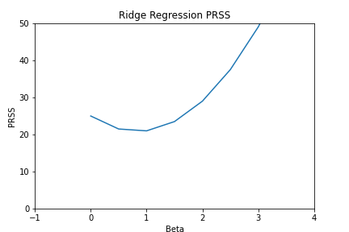

# Chapter 6 Conceptual Problems

## Problem 1.
### Part a)
The smallest training residual sum of squares (RSS) will occur for the "best subset selection" approach. This is because the algorithm uses the training set RSS to determine which model is the best and it is an exhaustive model (unlike the other two approaches).

### Part b)
It is not possible to definitively say which approach result in the model with the lowest test set RSS (lowest prediction error) _a priori_. However, "best subset selection" method has a large chance of overfitting the data resulting in a low training RSS but a larger test set RSS due to a high variance and low bias. For the other two method the only way to determine which approach may have produced the lowest test RSS indirect approaches such as cross-validation or some sort of information criterion needs to be employed.

### Part c)
**i.** True. By definition the $k+1$ model uses the $k$ models predictors as a subset to build upon.

**ii.** False. As the $k+1$ step removes a predictor, the $k$ model predictors  cannot be a subset.

**iii.** False.

**iv.** False.

**v.** False. This assumes that "forward subset selection" will always select the best predictors. However, the "best subset selection" may not even contain the first selected variable of FSS.

## Problem 2.
### Part a) Lasso Regularization
The true statement is:

> Less flexible and hence will give improved prediction accuracy when its increase in bias is less than its decrease in variance.

### Part b) Ridge Regularization
The true statement is:

> Less flexible and hence will give improved prediction accuracy when its increase in bias is less than its decrease in variance.

## Problem 3.
### Part a)

## Problem 4.

## Problem 5.
For this problem the number of data points is $n=2$ and the number of predictors is $p=2$. It also has the constraints:
\[
x_{11} = x_{12} \quad x_{22} = x_{21} \\
y_1 + y_2 = 0 \\
x_{11} + x_{21} = 0 \\
x_{22} + x_{12} = 0
\]
### Part a)
The ridge penalized RSS (with no intercept due to the constraints) is given by ,
\[
PRSS_{R} = \sum_{i=1}^{n}\left(y_i - \sum_{j=1}^{p}\left(\beta_{i}x_{ij}\right)\right)^2 + \lambda\sum_{j=1}^{p}\beta_{j}^2
\]
which, as with normal least squares, must be minimized with respect to $\boldsymbol{\beta}$. (Once again these are all estimators but the hats have been dropped).

### Part b)
Differentiating the above equation w.r.t. $\boldsymbol{\beta}$ gives,
\[
\dfrac{\partial PRSS_{R}}{\partial \beta_1} = 2(-x_{11})(y_1 - (\beta_{1}x_{11} + \beta_{2}x_{12})) + 2(-x_{21})(y_2 - (\beta_{1}x_{21} + \beta_{2}x_{22})) + 2\lambda \beta_1 \\
\dfrac{\partial PRSS_{R}}{\partial \beta_2} = 2(-x_{12})(y_1 - (\beta_{1}x_{11} + \beta_{2}x_{12})) + 2(-x_{22})(y_2 - (\beta_{1}x_{21} + \beta_{2}x_{22})) + 2\lambda \beta_2
\]
Setting these to 0 and using the constaints of the problem gives,
\[
-x_{11}y_1 + \beta_{1}x_{11}^2 + \beta_{2}x_{11}^2 - x_{22}y_2 + \beta_{1}x_{22}^2 + \beta_{2}x_{22}^2 + \lambda\beta_1 = 0 \\
-x_{11}y_1 + \beta_{1}x_{11}^2 + \beta_{2}x_{11}^2 - x_{22}y_2 + \beta_{1}x_{22}^2 + \beta_{2}x_{22}^2 + \lambda\beta_2 = 0
\]
Subtracting the second equation from the first results in,
\[
\lambda \beta_1 - \lambda \beta_2 = 0 \\
\Rightarrow \beta_1 = \beta_2
\]
regardless of the choice of lambda.

### Part c)
This is very similar to part a) however the regularizer is of a different form (norm). The penalized RSS for the lasso regularization is,
\[
PRSS_{L} = \sum_{i=1}^{n}\left(y_i - \sum_{j=1}^{p}\left(\beta_{i}x_{ij}\right)\right) + \lambda\sum_{j=1}^{p}|\beta_{j}|
\]
### Part d)
Similarly there is the same cancellation of the terms when minimizing as in part b). The final equality is,
\[
\lambda\left(\dfrac{\partial }{\partial \beta_1}|\beta_1| - \dfrac{\partial }{\partial \beta_2}|\beta_2|\right) = 0
\]

## Problem 6.
Toy model regularization with $n=p$ and $\textbf{X} = I(n)$ where $I(n)$ is the identity matrix of order $n$.

### Part a)
Ridge regression in this toy model with $n=1$ is,
\[
\begin{aligned}
PRSS_{R} &= \left(y_1 - \beta_1\right)^2 + \lambda \beta_1^2 \\
&= y_1^2 + \beta_1^2 - 2\beta_1y_1 + \lambda\beta_1^2 \\
&= (\lambda + 1)\beta_1^2 -2\beta_1y_1 + y_1^2
\end{aligned}
\]

This  is just a quadratic equation with no roots. Mimimizing this w.r.t. $\beta_1$,
\[
\beta_1 = \dfrac{y_1}{(\lambda + 1)}.
\]

## Problem 7.
