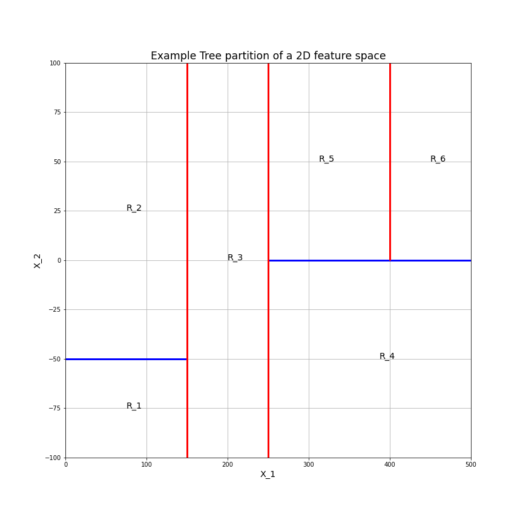
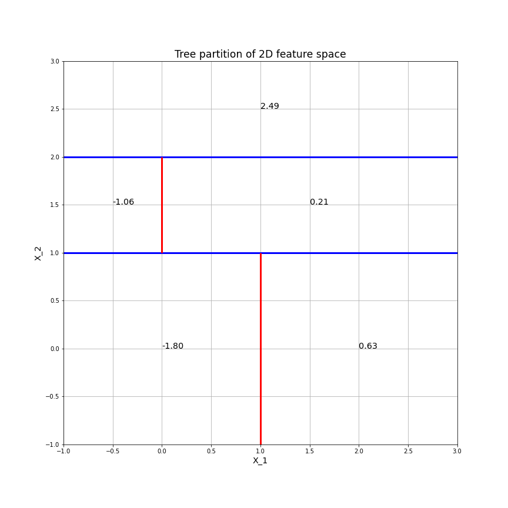

# Chapter 8 Conceptual Problems
## Problem 1
An example of a 2-dimensional predictor space split by a decision tree into 6 non overlapping regions is shown in the figure below.

This partition is the result of the following tree.

## Problem 4
### Part a)
The tree diagram corresponding to the feature space partitions is,

### Part b)
The tree diagram corresponds to the following feature space partitions,

