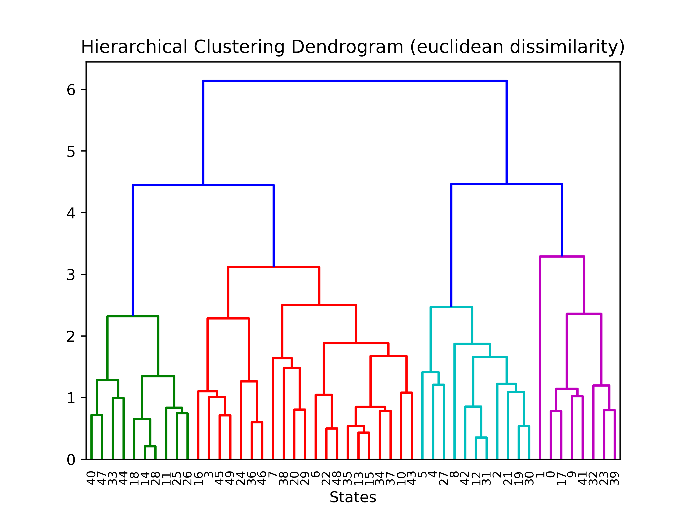
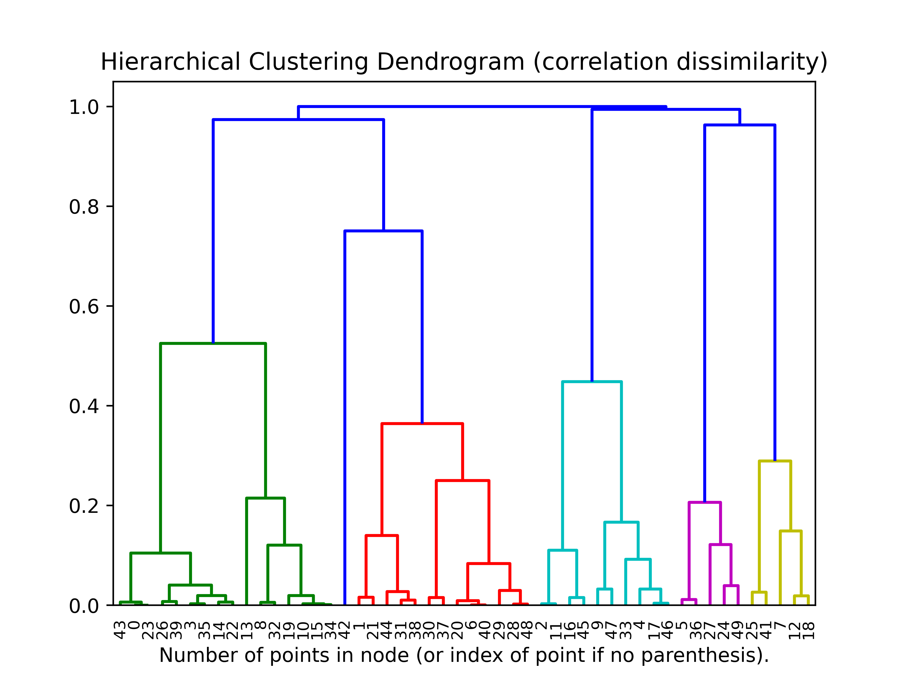
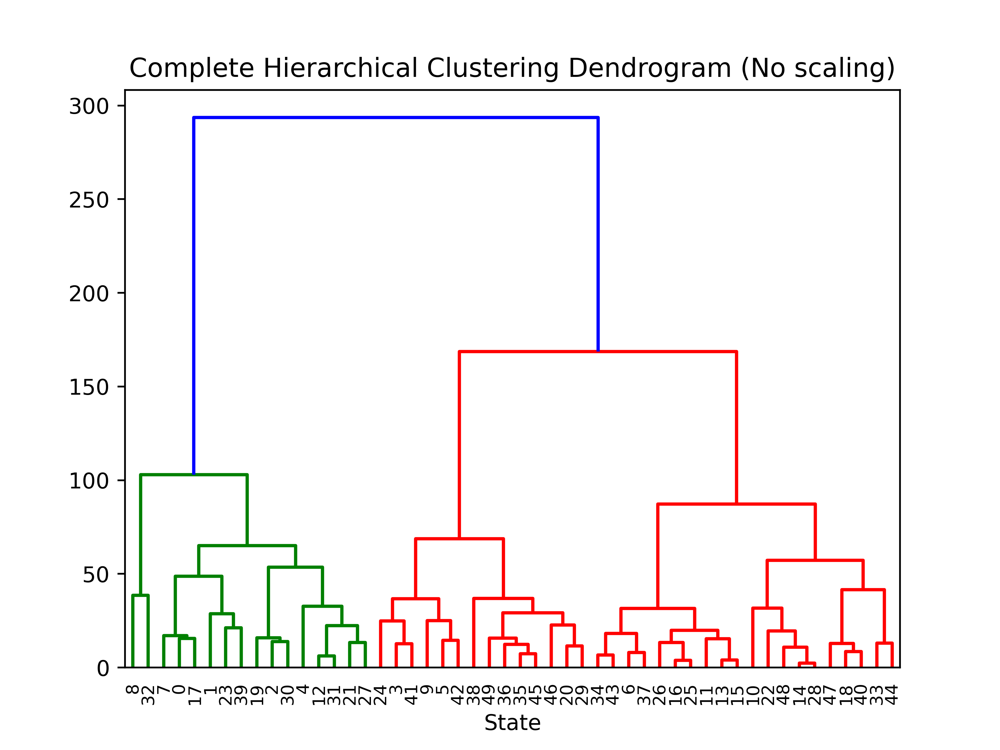
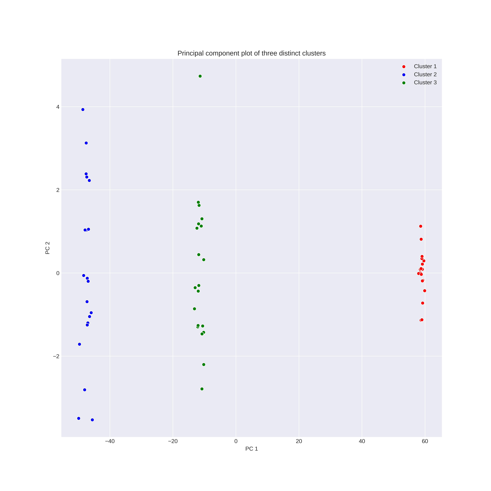

# Chapter 10: Unsupervised Learning
# Applied Problems
Load the standard libraries

```python
import pandas as pd
import numpy as np
import random

import matplotlib.pyplot as plt
import seaborn as sns

np.random.seed(102)
```

## Problem Seven
Load the US arrests dataset

```python
us_crime = pd.read_csv(os.path.join(DATA_DIR, "USArrests.csv"), index_col='Unnamed: 0')
```

Import and instantiate the standard scaler for scaling scaling th data such that $\mu = 0$ and $\sigma = 1$. Then fit and transform (can be done in a single step) the data.

Note: This will return a numpy array and we will therefore lose the state indices.

```python
from sklearn.preprocessing import StandardScaler

## Instantiate and fit the scaler
scaler = StandardScaler()
scaler.fit(us_crime[['Murder',  'Assault',  'UrbanPop',  'Rape']])
## Transform the data
us_crime =  scaler.transform(us_crime)
```

### Euclidean dissimalarity
First we will create a dendogram using a euclidean metric for the dissimilarity matrix. This is a distance matrix whose entries represent the distance in feature space between the $i$th and $j$th states for $p$ features,

\[
d_{ij} = \sqrt{\sum_{k=1}^p (x_{i,k} - x_{j,k})^2}.
\]

We instantiate and fit a hierarchial clustering (agglomerative) model. We use a 'complete' linkage model and compute the entire dendogram tree.

```python
from sklearn.cluster import AgglomerativeClustering

clusterer = AgglomerativeClustering(affinity='euclidean', compute_full_tree='auto', linkage='complete', distance_threshold=0, n_clusters=None)
```

To plot the dendogram we use the following function found in the documentation,

```python
def plot_dendrogram(model, **kwargs):
    # Create linkage matrix and then plot the dendrogram

    # create the counts of samples under each node
    counts = np.zeros(model.children_.shape[0])
    n_samples = len(model.labels_)
    for i, merge in enumerate(model.children_):
        current_count = 0
        for child_idx in merge:
            if child_idx < n_samples:
                current_count += 1  # leaf node
            else:
                current_count += counts[child_idx - n_samples]
        counts[i] = current_count

    linkage_matrix = np.column_stack([model.children_, model.distances_,
                                      counts]).astype(float)

    # Plot the corresponding dendrogram
    dendrogram(linkage_matrix, **kwargs)
```

The final euclidean dendogram is,

```python
clusterer = clusterer.fit(us_crime)

plt.title('Hierarchical Clustering Dendrogram')
# plot the top three levels of the dendrogram
plot_dendrogram(heir_clusterer, truncate_mode='level')
plt.xlabel("Number of points in node (or index of point if no parenthesis).")
plt.savefig(os.path.join(IMAGE_DIR, "p7_Euclid_dendogram.png"), dpi=500)
plt.show()
```



**To update: restore state names rather than indices to dendogram**.

### Correlation dissimilarity

For the correlation dissimilarity we need to construct our own dissimilarity matrix as it is not standard. As euclidean distance matrix relates to the $l2$ distance between observations, the correlation matrix denotes how correlated to observations are in the feature space. We will be using the 'Pearson' correlation. However, Pearson's correlation coefficient is 0 for no correlation, 1 for total positive correlation and -1 for total negative correlation. This is nearly the opposite of a distance matrix (0 for very similar and 1 for no similarity) and therefore we must transform each correlation value $r_{ij}$ with,

\[
d_{ij} = 1 - \left|r_{ij}\right|
\]

One thing to keep in mind here is the correlation target. In earlier sections we used the correlation matrix to determine the correlation of the fetures over the rows (observations) to help determine the relationship between the features (for examples see Chapter 3). Here we are doing the opposite, we want to find which observations correlate most highly with each other over the feature space. Therefore we will have to take the transpose of the dataframe.

To compare the difference between the raw correlation matrix and the correlation dissimilary matrix we have the following plot.


```python
## Transpose the data matrix and find correlation of rows (observations)
corr_mat = data.transpose().corr()
## Vectorize the correlation dissimilarity function
diss = np.vectorize(lambda x: 1- np.abs(x), otypes=[np.float])
## Generate a dataframe of the correlation dissimilarity
diss_corr = corr_mat.apply(diss)

fig, ((ax1), (ax2))  = plt.subplots(nrows=1, ncols=2, figsize=(24,12))
sns.heatmap(corr_mat, ax=ax1)
sns.heatmap(diss_corr, ax=ax2)
ax1.set_title("Raw correlation matrix")
ax2.set_title("Distance correlation matrix")
plt.show()
```


To find the dendogram with the correlation dissimilarity we have to scale the features to the standard normal (it will still work without scaling but the denogram will be very squashed, Try it!)

```python
## Instantiate the scaler and fit the data to the columns
scaler = StandardScaler()
scaler.fit(data[['Murder',  'Assault',  'UrbanPop',  'Rape']])
X = scaler.transform(data)

## Find the correlation matrix and map the distance function
corr_mat = np.corrcoef(X)
diss_corr = diss(corr_mat)

## Instantiate the clusterer with 'precomputed' affinity.
heir_clusterer = AgglomerativeClustering(affinity='precomputed', compute_full_tree='auto', linkage='complete', distance_threshold=0, n_clusters=None)

## Fit the clustered to the pre computed distance matrix (correlation dissimilarity)
heir_clusterer = heir_clusterer.fit(diss_corr)

## Plot the resulting dendogram
plt.title('Hierarchical Clustering Dendrogram')
# plot the top three levels of the dendrogram
plot_dendrogram(heir_clusterer, truncate_mode='level')
plt.xlabel("Number of points in node (or index of point if no parenthesis).")
plt.savefig(os.path.join(IMAGE_DIR, "p7_correlation_dendogram.png"), dpi=500)
plt.show()
```



This does not appear to be similar to the euclidean distance matrix.


**Return to this**

## Problem Eight
### Part a)
This problem is simple using the predefined attributes of the PCA object in sklearn. We instantiate the PCA object with the following,
```python
from sklearn.preprocessing import StandardScaler
from sklearn.decomposition import PCA

## Load the dataset
us_crime = pd.read_csv(os.path.join(DATA_DIR, "USArrests.csv"), index_col='Unnamed: 0')
## Instantiate the scaler and fit the data to the columns
scaler = StandardScaler()
scaler.fit(us_crime[['Murder',  'Assault',  'UrbanPop',  'Rape']])
X = scaler.transform(us_crime)

## Instantiate and fit the PCA model
pca=PCA(n_components=4)
pca.fit(X)
```

The porportion of variance explained is then easily called with the attribute,
```python
pve_ratios = pca.explained_variance_ratio_
print(pve_ratios)
```

```
[0.62006039 0.24744129 0.0891408  0.04335752]
```

A cumulative set of PVE can be generated with

```python
cul_pve = [0]
for idx, val in enumerate(pve_ratios):
    next = cul_pve[idx] + val
    cul_pve.append(next)
cul_pve.pop(0)

print(cul_pve)
```

```
[0.62006039, 0.86750168, 0.95664248, 0.99999999]
```

We plot both the individual and cumulative PVEs below,
```python
fig, ((ax1), (ax2)) = plt.subplots(nrows=1, ncols=2, figsize=(24,12))

g = sns.lineplot([0,1,2,3], pve_ratios,  ax=ax1)
f = sns.lineplot([0,1,2,3], cul_pve,  ax=ax2)

g.set_xticks([0,1,2,3])
f.set_xticks([0,1,2,3])
PCA_labels = ["PC1", "PC2", "PC3", "PC4"]
g.set_xticklabels(PCA_labels)
f.set_xticklabels(PCA_labels)

ax1.set_xlabel("Principal components", fontsize='x-large')
ax1.set_ylabel("Porportion of explained Variance", fontsize='x-large')

ax2.set_xlabel("Principal components", fontsize='x-large')
ax2.set_ylabel("Cumulative porportion of explained Variance", fontsize='x-large')

ax1.set_title("Skree Plot", fontsize='xx-large')
ax2.set_title("Cumulative Plot", fontsize='xx-large')

plt.show()
```


### Part b)
Here we will calculate the pve's ourselves with the raw PCA matrix and dataset.

First we do it for a single PCA component (PC1).

*Note: The PCA matrix produced by sklearn is the transpose of the one described in the text. That is, we use $\phi_{mj}$, where $m$ are the PCs and $j$ are the original features.*

```python
pca_mat = pca.components_

## For the first component only, m = 1
ve = 0
for i in range(X.shape[0]):
    inner_sum = 0
    ## For each observation calculate the linear combination of pca and value
    for j in range(pca_mat.shape[0]):
        iter = X[i,j]*pca_mat[0,j]
        inner_sum += iter
    ## Square this sum and add it to the total ve
    ve += inner_sum**2
## Divide by the number of observations
ve = ve/X.shape[0]
print("Variance explained for PC1: ", ve)
```

```
Variance explained for PC1:  2.480241579149494
```

This can simply be calculated for every PC. To calculate the PVE we first calculate the total variance of the dataset,

```python
## Calculate the total variance of the data set
tot_var = 0
for i in range(X.shape[0]):
    inner_sum = 0
    ## squar the matrix element
    for j in range(X.shape[1]):
        iter = X[i,j]*X[i,j]
        inner_sum += iter
    ## Add the inner sum to the total variance
    tot_var += inner_sum
tot_var = tot_var/X.shape[0]
print("Total variance of dataset: ", tot_var)
```

```
Total variance of dataset:  4.0
```

We can now calculate the porportion of variance explained for each  PC.


```python
## Calculate porportion of variance explained
for m in range(pca_mat.shape[0]):
    pve = 0
    for i in range(X.shape[0]):
        inner_sum = 0
        ## For each observation calculate the linear combination of pca and value
        for j in range(pca_mat.shape[0]):
            iter = X[i,j]*pca_mat[m,j]
            inner_sum += iter
        ## Square this sum and add it to the total ve
        pve += inner_sum**2
    ## Divide by the number of observations and the total variance
    pve = pve/(X.shape[0]*tot_var)
    print("Porportion of variance explained by PC{0}: {1}".format(m+1, pve))
```

```
Porportion of variance explained by PC1: 0.6200603947873735
Porportion of variance explained by PC2: 0.24744128813496036
Porportion of variance explained by PC3: 0.08914079514520756
Porportion of variance explained by PC4: 0.043357521932458856
```

## Problem Nine
### Part a)
Load the dataset
```python
## Load dataset
data = pd.read_csv(os.path.join(DATA_DIR, "USArrests.csv"), index_col='Unnamed: 0')
```
As transforming the data removes the indicies (state name) we define a function to create dictionary of the index location and original index.
```python
## Create a dictionary of the index and state name for restoring the index after transformations
def index_dict(pd_index):
    dict = {}
    for idx, val in enumerate(pd_index):
        dict[idx] = val
    return dict
```

Index the dataframe.
```python
idx_dict = index_dict(us_crime.index)
```
Now fit the hierarchial clusterer with euclidean dissimilarity and complete linkage
```python
from sklearn.preprocessing import StandardScaler
from sklearn.cluster import AgglomerativeClustering
from scipy.cluster.hierarchy import dendrogram

hier_clusterer = AgglomerativeClustering(affinity='euclidean', compute_full_tree='auto', linkage='complete', distance_threshold=0, n_clusters=None)

hier_clusterer = hier_clusterer.fit(data)

plt.title('Complete Hierarchical Clustering Dendrogram (No scaling)')
# plot the top three levels of the dendrogram
plot_dendrogram(hier_clusterer, truncate_mode='level')
plt.xlabel("State")
plt.show()
```



### Parts b) and c)
For part b) we do not use the StandardScaler to scale the raw data. Cut the dendogram off at three distinct clusters.

```python
hier_clusterer = AgglomerativeClustering(affinity='euclidean', compute_full_tree='auto', linkage='complete', distance_threshold=None, n_clusters=3)
hier_clusterer = hier_clusterer.fit(data)
```

Return the clusters and reindex with the index dictionary

```python
cluster_labels = {i: np.where(hier_clusterer.labels_ == i)[0] for i in range(hier_clusterer.n_clusters)}

## Create a new dictionary to store named cluster
state_dict = {}
for c, state in cluster_labels.items():
    ## reindex each luster
    state_clusters = [index_dict[st] for st in state]
    ## Store in dictionary
    state_dict[c] = state_clusters
## Set as new dictionary
non_scaled = state_dict
```

Similarly, for part c) we do the same process with the data prescaled,
```python
## Scale the data
scaler = StandardScaler()
scaler.fit(data[['Murder',  'Assault',  'UrbanPop',  'Rape']])
data =  scaler.transform(data)

## Train the clusterer
hier_clusterer = AgglomerativeClustering(affinity='euclidean', compute_full_tree='auto', linkage='complete', distance_threshold=None, n_clusters=3)
hier_clusterer = hier_clusterer.fit(data)

cluster_labels = {i: np.where(hier_clusterer.labels_ == i)[0] for i in range(hier_clusterer.n_clusters)}

## Create a new dictionary to store named cluster
state_dict = {}
for c, state in cluster_labels.items():
    ## reindex each luster
    state_clusters = [index_dict[st] for st in state]
    ## Store in dictionary
    state_dict[c] = state_clusters
## Set as new dictionary
scaled = state_dict
```

We can then compare these two clusters. Ideally this would be done on a map as it is geological data, I will update this with geopandas to demonstrate this. Here we will just compare the most similar clusters.

We crudely define similarity by the number of common states in each cluster,

```python
## find most common clusters
sim_dict = {}
for key1, val1 in non_scaled.items():
    sim_count = 0
    for key2, val2 in scaled.items():
        ## Count of common elements in list1 and list2
        count = len(list(set(val1).intersection(val2)))
        if count > sim_count and key2 not in sim_dict.values():
            sim_count = count
            sim_dict[key1] = key2
```

This is not the only way, or most sophisticated way to compare clusters. However as there is no 'true' cluster to learn from we can not be entirely sure.

We can now generate a markdown table with this data.

```python
print("{} | {} ".format("Non-scaled", "Scaled"))
print("---|----")
for c, list1 in non_scaled.items():
    print("Group {} | Group {} ".format(c, c))
    list2 = scaled[sim_dict[c]]
    for i in range(max(len(list1), len(list2))):
        if i >= len(list1):
            item1 = " "
            item2 = list2[i]
        elif i >= len(list2):
            item1 = list1[i]
            item2 = " "
        else:
            item1 = list1[i]
            item2 = list2[i]
        print("{} | {}".format(item1, item2))
```


Non-scaled | Scaled
---|----
**Group 1** | **Group 1**
Alabama | Arizona
Alaska | California
Arizona | Colorado
California | Florida
Delaware | Illinois
Florida | Maryland
Illinois | Michigan
Louisiana | Nevada
Maryland | New Mexico
Michigan | New York
Mississippi | Texas
Nevada |
New Mexico |
New York |
North Carolina |
South Carolina |
**Group 2** | **Group 2**
Connecticut | Arkansas
Hawaii | Connecticut
Idaho | Delaware
Indiana | Hawaii
Iowa | Idaho
Kansas | Indiana
Kentucky | Iowa
Maine | Kansas
Minnesota | Kentucky
Montana | Maine
Nebraska | Massachusetts
New Hampshire | Minnesota
North Dakota | Missouri
Ohio | Montana
Pennsylvania | Nebraska
South Dakota | New Hampshire
Utah | New Jersey
Vermont | North Dakota
West Virginia | Ohio
Wisconsin | Oklahoma
  | Oregon
  | Pennsylvania
  | Rhode Island
  | South Dakota
  | Utah
  | Vermont
  | Virginia
  | Washington
  | West Virginia
  | Wisconsin
  | Wyoming
**Group 3** | **Group 3**
Arkansas | Alabama
Colorado | Alaska
Georgia | Georgia
Massachusetts | Louisiana
Missouri | Mississippi
New Jersey | North Carolina
Oklahoma | South Carolina
Oregon | Tennessee
Rhode Island |
Tennessee |
Texas |
Virginia |
Washington |
Wyoming |

## Problem Ten
### Part a)
Generate the disparate cluster data with numpy

```python
## Generate the data
true_cluster_1 = np.random.normal(loc=-5, scale=0.5, size=(20,50))
true_cluster_2 = np.random.normal(loc=10, scale=1, size=(20,50))
true_cluster_3 = np.random.normal(loc=5, scale=0.9, size=(20,50))

## Combine the data into a single array
combined = np.append(true_cluster_1, np.append(true_cluster_2, true_cluster_3, axis=0), axis=0)
```

### Part b)
Train a PCA model and plot the resultant clusters. This is relatively simple as the data remains sorted in the transformed array,

```python
from sklearn.decomposition import PCA

## Break the data into Principal components
pca = PCA(n_components=2)
pca.fit(data)

X = pca.transform(data)

fig, ax1 = plt.subplots(nrows=1, ncols=1, figsize=(12,12))
sns.scatterplot(x=X[0:20,0], y=X[0:20,1], color='r', label='Cluster 1')
sns.scatterplot(x=X[20:40,0], y=X[20:40,1], color='b', label="Cluster 2")
sns.scatterplot(x=X[40:60,0], y=X[40:60,1], color='g', label="Cluster 3")

ax1.set_xlabel("PC 1")
ax1.set_ylabel("PC 2")

ax1.set_title("Principal component plot of three distinct clusters")

ax1.legend()
plt.show()
```



### Part c)
Now we train a Kmeans model with three cluster labels

```python
from sklearn.cluster import KMeans

## Break the data into Principal components
kmeans = KMeans(n_clusters=3)

X = kmeans.fit_predict(data)
print("True Cluster 0 prdictions:")
print(X[0:20])
print("True Cluster 1 prdictions:")
print(X[20:40])
print("True Cluster 2 prdictions:")
print(X[40:60])
```

```
True Cluster 0 prdictions:
[0 0 0 0 0 0 0 0 0 0 0 0 0 0 0 0 0 0 0 0]
True Cluster 1 prdictions:
[1 1 1 1 1 1 1 1 1 1 1 1 1 1 1 1 1 1 1 1]
True Cluster 2 prdictions:
[2 2 2 2 2 2 2 2 2 2 2 2 2 2 2 2 2 2 2 2]
```

We see that there is perfect recall of the true clusters. We can not produce a nice plot as in part b) as it is 50 dimensional.

### Part d)
For two clusters just set the above code `n_clusters = 2`

```
True Cluster 0 prdictions:
[0 0 0 0 0 0 0 0 0 0 0 0 0 0 0 0 0 0 0 0]
True Cluster 1 prdictions:
[1 1 1 1 1 1 1 1 1 1 1 1 1 1 1 1 1 1 1 1]
True Cluster 2 prdictions:
[1 1 1 1 1 1 1 1 1 1 1 1 1 1 1 1 1 1 1 1]
```

Here it has clustered the first two clusters into one. This seems intuitive looking at the PCA plot as these two clusters are the most similar on the first two PCs.

### Part e)
For two clusters just set the above code `n_clusters = 4`

```
[1 1 1 1 1 1 1 1 1 1 1 1 1 1 1 1 1 1 1 1]
True Cluster 1 prdictions:
[3 3 0 0 0 3 3 0 0 0 0 0 3 0 0 0 3 3 0 0]
True Cluster 2 prdictions:
[2 2 2 2 2 2 2 2 2 2 2 2 2 2 2 2 2 2 2 2]
```

Setting the number of desired clusters as more than the true number measn that at least one will have to split up. Seeting $n=4$ meant that the second cluster was split. This is because it has the most variance compared to the other two clusteres.

### Part f)
First we preform PCA then cluster the data with KMeans,

```python
## Break the data into Principal components
pca = PCA(n_components=2)
pca.fit(data)
X_PCA = pca.transform(data)

kmeans = KMeans(n_clusters=3)
X = kmeans.fit_predict(X_PCA)
print("True Cluster 0 prdictions:")
print(X[0:20])
print("True Cluster 1 prdictions:")
print(X[20:40])
print("True Cluster 2 prdictions:")
print(X[40:60])
```

```
True Cluster 0 prdictions:
[0 0 0 0 0 0 0 0 0 0 0 0 0 0 0 0 0 0 0 0]
True Cluster 1 prdictions:
[1 1 1 1 1 1 1 1 1 1 1 1 1 1 1 1 1 1 1 1]
True Cluster 2 prdictions:
[2 2 2 2 2 2 2 2 2 2 2 2 2 2 2 2 2 2 2 2]
```

As expected we get perfect clustering. This is definitely expected as we can see that the three clusters in the part a) plot are distinctly separate.

### Part g)
Now we see what happens to KMeans clustering when we scale the data first,

```python
## Break the data into Principal components
scaler = StandardScaler(with_mean=False)
scaler.fit(data)
data =  scaler.transform(data)

kmeans = KMeans(n_clusters=3)

X = kmeans.fit_predict(data)
print("True Cluster 0 prdictions:")
print(X[0:20])
print("True Cluster 1 prdictions:")
print(X[20:40])
print("True Cluster 2 prdictions:")
print(X[40:60])
```

```
True Cluster 0 prdictions:
[0 0 0 0 0 0 0 0 0 0 0 0 0 0 0 0 0 0 0 0]
True Cluster 1 prdictions:
[1 1 1 1 1 1 1 1 1 1 1 1 1 1 1 1 1 1 1 1]
True Cluster 2 prdictions:
[2 2 2 2 2 2 2 2 2 2 2 2 2 2 2 2 2 2 2 2]
```
perfect recall again.
