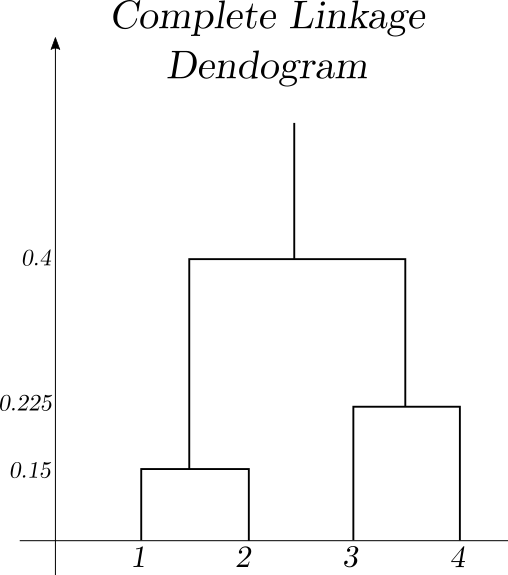
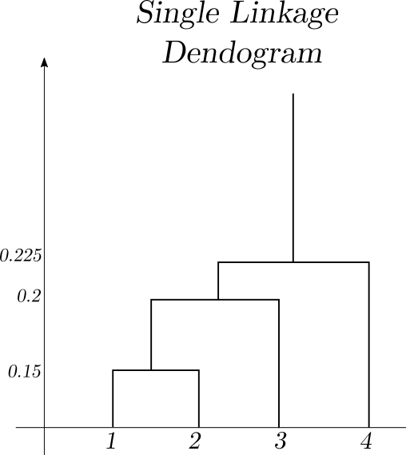
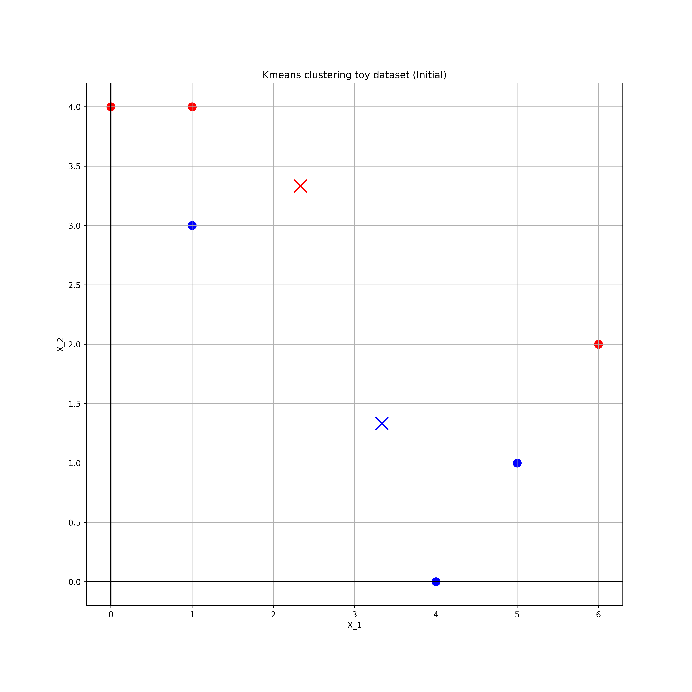
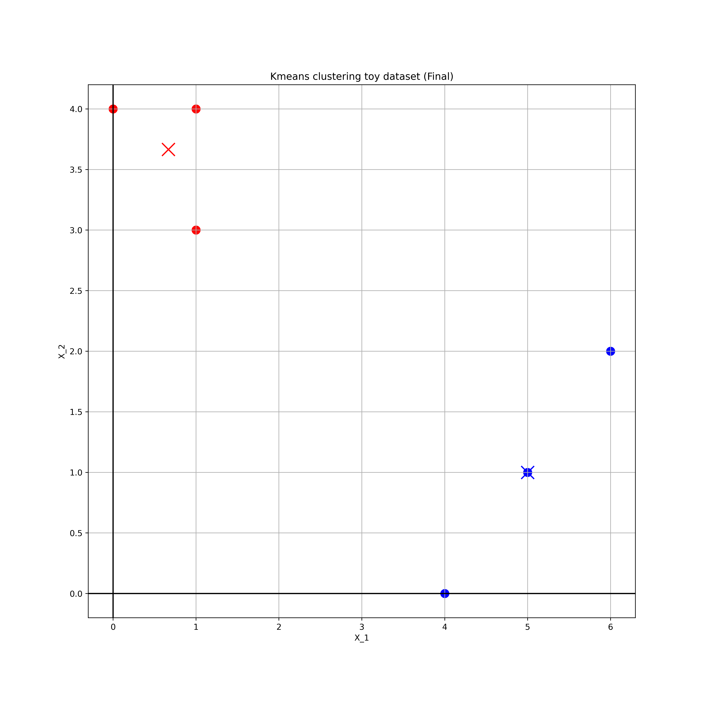

# Chapter 10: Unsupervised Learning
# Conceptual Problems

## Problem One

### Part a)
Prove that
\[
\dfrac{1}{\left|C_k\right|}\sum_{i,i' \in C_{k}}\sum_{j=1}^{P} \left(x_{ij} - x_{i'j}\right)^2 = 2\sum_{i \in C_{k}}\sum_{j=1}^{P} \left(x_{ij} - \bar{x}_{kj}\right)^2
\]

where
\[
\bar{x}_{kj} = \dfrac{1}{\left|C_k\right|} \sum_{i \in C_{k}}x_{ij}.
\]

Also note that
\[
\sum_{i \in C_k}1 = \left|C_k\right|.
\]
Below is a detailed proof,

\[
\begin{aligned}
\dfrac{1}{\left|C_k\right|}\sum_{i,i' \in C_{k}}\sum_{j=1}^{P} \left(x_{ij} - x_{i'j}\right)^2 &= \sum_{j=1}^{P}\dfrac{1}{\left|C_k\right|}\sum_{i\in C_{k}}\sum_{i'\in C_{k}} \left(x_{ij} - x_{i'j}\right)^2 \\
&= \sum_{j=1}^{P}\dfrac{1}{\left|C_k\right|}\sum_{i\in C_{k}}\sum_{i'\in C_{k}} \left(x_{ij}^2 + x_{i'j}^2 -2x_{ij}x_{i'j}\right) \\
&= \sum_{j=1}^{P}\dfrac{1}{\left|C_k\right|} \left(\sum_{i\in C_{k}}\sum_{i'\in C_{k}}x_{ij}^2 + \sum_{i\in C_{k}}\sum_{i'\in C_{k}}x_{i'j}^2 -2\sum_{i\in C_{k}}\sum_{i'\in C_{k}}x_{ij}x_{i'j}\right) \\
&=   \sum_{j=1}^{P}\dfrac{1}{\left|C_k\right|} \left(\sum_{i\in C_{k}}x_{ij}^2\sum_{i'\in C_{k}}1 + \sum_{i'\in C_{k}}x_{i'j}^2\sum_{i\in C_{k}}1 -2\sum_{i\in C_{k}}x_{ij}\sum_{i'\in C_{k}}x_{i'j}\right) \\
&=  \sum_{j=1}^{P}\left(\sum_{i\in C_{k}}x_{ij}^2 + \sum_{i'\in C_{k}}x_{i'j}^2 -2\left|C_k\right|\bar{x}_{kj}^2\right) \\
&= 2\sum_{j=1}^{P}\left(\sum_{i\in C_{k}}x_{ij}^2 -\left|C_k\right|\bar{x}_{kj}^2\right)
\end{aligned}
\]

Now we can transform this by doing a type of "completing the square", and using $|C_k| = \dfrac{1}{\bar{x}_{kj}} \sum_{i \in C_{k}}x_{ij}$.

\[
\begin{aligned}
\dfrac{1}{\left|C_k\right|}\sum_{i,i' \in C_{k}}\sum_{j=1}^{P} \left(x_{ij} - x_{i'j}\right)^2 &= 2\sum_{j=1}^{P}\left(\sum_{i\in C_{k}}x_{ij}^2 -\left|C_k\right|\bar{x}_{kj}^2 - \left|C_k\right|\bar{x}_{kj}^2 + \left|C_k\right|\bar{x}_{kj}^2\right) \\
&= 2\sum_{j=1}^{P}\left(\sum_{i\in C_{k}}x_{ij}^2 -2\left|C_k\right|\bar{x}_{kj}^2  + \left|C_k\right|\bar{x}_{kj}^2\right) \\
&= 2\sum_{j=1}^{P}\left(\sum_{i\in C_{k}}x_{ij}^2 -2\sum_{i \in C_{k}}x_{ij}\bar{x}_{kj}  + \sum_{i \in C_k}\bar{x}_{kj}^2\right) \\
&= 2\sum_{j=1}^{P}\sum_{i\in C_{k}}\left(x_{ij}^2 -2x_{ij}\bar{x}_{kj}  + \bar{x}_{kj}^2\right) \\
&= 2\sum_{i \in C_{k}}\sum_{j=1}^{P} \left(x_{ij} - \bar{x}_{kj}\right)^2
\end{aligned}
\]

## Problem Two
### Part a)
In a complete (maximal dissimilarity) linkage regime the dissimilarity matrix decomposes as such.
\[
\begin{array}{c}
 \begin{array}{c} \\{1\\} &  \\{2\\}  & \\{3\\}  & \\{4\\} \end{array} \\
  \left(\begin{array}{cccc}
      0 & 0.3 & 0.4 & 0.7 \\
      0.3 & 0 & 0.5 & 0.8 \\
      0.4 & 0.5 & 0 & 0.45 \\
      0.7 & 0.8 & 0.45 & 0
  \end{array}\right)
\end{array}
\rightarrow
\begin{array}{c}
 \begin{array}{ccc} \\{1, 2\\}  & \\{3\\}  & \\{4\\} \end{array} \\
  \left(\begin{array}{ccc}
      0 & 0.5 & 0.8 \\
      0.5 & 0 & 0.45 \\
      0.8 & 0.45 & 0
  \end{array}\right)
\end{array}
\rightarrow
\begin{array}{c}
 \begin{array}{cc} \\{1, 2\\}  & \\{3, 4\\} \end{array} \\
  \left(\begin{array}{cc}
      0 & 0.8 \\
      0.8 & 0
  \end{array}\right)
\end{array}
\]

This corresponds the the dendogram.

### Part b)

In a complete (maximal dissimilarity) linkage regime the dissimilarity matrix decomposes as such.

\[
\begin{array}{c}
 \begin{array}{c} \\{1\\} &  \\{2\\}  & \\{3\\}  & \\{4\\} \end{array} \\
  \left(\begin{array}{cccc}
      0 & 0.3 & 0.4 & 0.7 \\
      0.3 & 0 & 0.5 & 0.8 \\
      0.4 & 0.5 & 0 & 0.45 \\
      0.7 & 0.8 & 0.45 & 0
  \end{array}\right)
\end{array}
\rightarrow
\begin{array}{c}
 \begin{array}{ccc} \\{1, 2\\}  & \\{3\\}  & \\{4\\} \end{array} \\
  \left(\begin{array}{ccc}
      0 & 0.4 & 0.7 \\
      0.4 & 0 & 0.45 \\
      0.7 & 0.45 & 0
  \end{array}\right)
\end{array}
\rightarrow
\begin{array}{c}
 \begin{array}{cc} \\{1, 2, 3 \\}  & \\{4\\} \end{array} \\
  \left(\begin{array}{cc}
      0 & 0.45 \\
      0.45 & 0
  \end{array}\right)
\end{array}
\]

This corresponds the the dendogram.

### Part c)

Cutting the compete linkage dendogram into two clusters results in clusters $\\{1,2 \\}$ and $\\{ 3,4 \\}$.

### Part d)
Cutting the compete linkage dendogram into two clusters results in clusters $\\{1,2,3 \\}$ and $\\{ 4 \\}$.

## Problem Three
### Parts a) and b)

Initially assign the points to the following classes,

|Obs | $X_1$ | $X_2$ | Initial Class |
|----|-------|-------|---------------|
|1   |1   |4  |1   |
|2   |1   |3   |2   |
|3   |0   |4   |1   |
|4   |5   |1   |2   |
|5   |6   |2   |1   |
|6   |4   |0   |2   |

These are plotted in the following figure

The red points are for $k=1$ and blue for $k=2$.

### Part c)

The centroids of the points are
\[
k=1, \quad \left(\dfrac{7}{3}, \dfrac{10}{3} \right) \\
k=2, \quad \left(\dfrac{10}{3}, \dfrac{4}{3} \right) \\
\]

These centroids are represented by crosses in the above diagram

### Parts d) and e)
By inspection, we can reassign classes based on the closest centroid,
\[
1 \rightarrow 1, \quad 3 \rightarrow 1, 2 \rightarrow 1 \\
4 \rightarrow 1, \quad 5 \rightarrow 2, 6 \rightarrow 2 \\
\]

### Part f)
The final clusters and centroids are plotted below,

## Problem Four
### Part a)
Complete linkage is the maximal approach and therefore $\\{1,2,3\\}$ in complete linkage will have a greater than or equal to dissimilarity to $\\{4,5\\}$ than in the single (minimal) linkage regime. Therefore, the combination in single linkage will occur at a lower than or equal point in the dendogram.

For example consider the decompostion of the following dissimilarity matrix under the two schemes
\[
\begin{array}{c}
 \begin{array}{ccc} \\{1, 2\\}  & \\{3\\}  & \\{4,5\\} \end{array} \\
  \left(\begin{array}{ccc}
      0 & 0.1 & 0.4 \\
      0.1 & 0 & 0.5 \\
      0.4 & 0.5 & 0
  \end{array}\right)
\end{array}
\xrightarrow{Complete}
\begin{array}{c}
 \begin{array}{cc} \\{1, 2, 3 \\}  & \\{4,5\\} \end{array} \\
  \left(\begin{array}{cc}
      0 & 0.4 \\
      0.4 & 0
  \end{array}\right)
\end{array} \\
\begin{array}{c}
 \begin{array}{ccc} \\{1, 2\\}  & \\{3\\}  & \\{4,5\\} \end{array} \\
  \left(\begin{array}{ccc}
      0 & 0.1 & 0.4 \\
      0.1 & 0 & 0.5 \\
      0.4 & 0.5 & 0
  \end{array}\right)
\end{array}
\xrightarrow{Single}
\begin{array}{c}
 \begin{array}{cc} \\{1, 2, 3 \\}  & \\{4,5\\} \end{array} \\
  \left(\begin{array}{cc}
      0 & 0.5 \\
      0.5 & 0
  \end{array}\right)
\end{array}
\]

## Problem Five

### Raw by price
The simplest clustering (for k=2 only) will be when the products are scaled for price. In this case, the two clusters will be {yellow, blue red, pink} and {black, orange, light blue, green} as the number of socks will have little impact and the cluster centers will approximatey be "bought a computer" and "didn't buy a computer".

### Raw by number of objects
Clustering the data only by the unscaled number of objects is more difficult. Here the number of computers will not shift the cluster centers too much and the clusters will primarily be determined by the number of socks bought. By inspection the clusters might be {black, pink, orange, light blue, red} and {green, yellow, blue}. Though, without calculation, these may vary slightly.

### Both predictors scaled
By inspection, we could cluster them by {orange, yellow, blue, red, pink} and {black, light blue, green}. Though once again these could vary.

Here we see that, depending on the processing and representation of the data, we can generate very different clusters with the same data.
