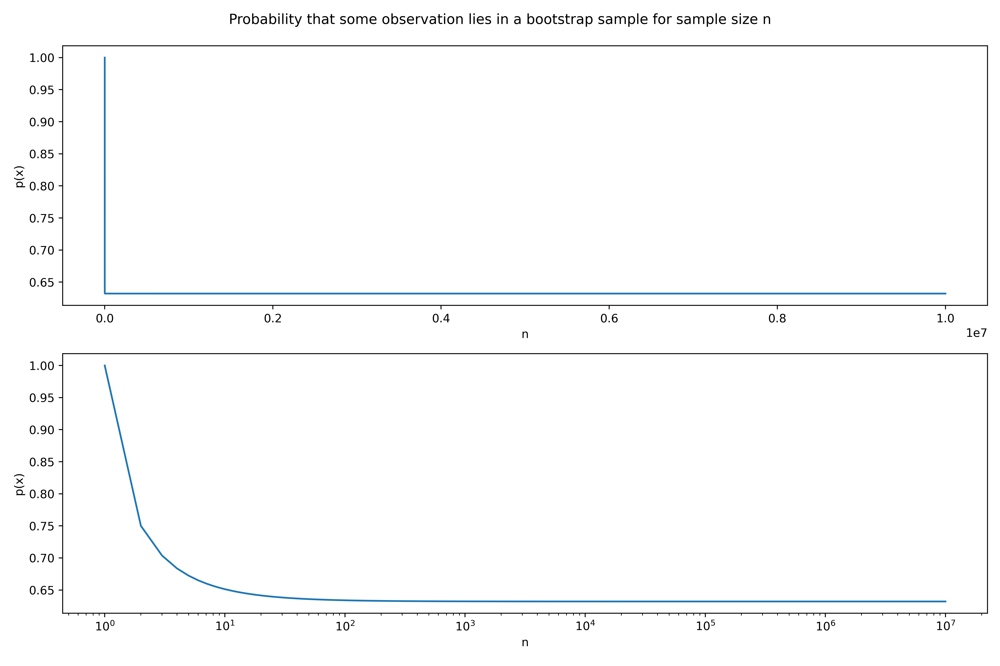

# Chapter Five: Resampling Methods
# Conceptual Problems

## Problem One
Given a combination of variable $X$ with variance '$\sigma_{X}$ and $Y$ with variance '$\sigma_{Y}$. For a combination of these variables $\alpha X + (1-\alpha) Y$ find value of $\alpha$ which minimizes the total variance $Var$.
\[
\begin{aligned}
Var &= Var(\alpha X + (1-\alpha) Y) \\
&= Var(\alpha X) + Var((1-\alpha) Y) + 2\times Cov(\alpha X, (1-\alpha) Y) \\
&= \alpha^2Var(X) + (1-\alpha)^2Var(Y) + 2\alpha(1-\alpha)Cov(X,  Y) \\
&= \alpha^2\sigma_X^2 + (1-\alpha)^2\sigma_Y^2 + 2\alpha\sigma_{XY} - 2\alpha^2\sigma_{XY}
\end{aligned}
\]
Minimizing this with respect to $\alpha$,
\[
\begin{aligned}
\dfrac{dVar}{d\alpha} &=  2\alpha\sigma_X^2 - 2(1-\alpha)\sigma_Y^2 + 2\sigma_{XY} - 4\alpha\sigma_{XY} \\
\\
\text{Setting this equal to 0} \\
\\
0 &= 2\alpha_{\text{min}}\sigma_X^2 - 2(1-\alpha_{\text{min}})\sigma_Y^2 + 2\sigma_{XY} - 4\alpha_{\text{min}}\sigma_{XY} \\
\Rightarrow \alpha_{\text{min}} &= \dfrac{\sigma_Y^2 - \sigma_{XY}}{\sigma_X^2 + \sigma_Y^2 - 2\sigma_{XY}}
\end{aligned}
\]

## Problem Two
### Part a)
It is easier to first ask, "What is the probability that the first observation in a bootstrap sample is the $j$th element of the original dataset". It is simply $1/n$ as there are $n$ independent choices.

Therefore the probability that the $j$th element is *not* the first observation is $1 - 1/n$.

### Part b)
This is identical to part a) as the choices are independent.

$1 - 1/n$.

### Part c)
Continuing on from the part a) and b) the probabilty of them both not being the $j$th observation is $(1 - 1/n)(1 - 1/n)$. Extrapolating this for the first $k$ observations of the bootstrap sample *not* being the $j$th point is

\[
p(x) = (1 - 1/n)^k
\]

Therefore, for the $j$th point not being in the entire bootstrap sample is $(1 - 1/n)^n$.

### Part d)-f)
The probability that the $j$th point *is* in the bootstrap sample is then,
\[
p(x) = 1 - (1 - 1/n)^n
\]

| n | p(x) |
|---|------|
| 5 | 0.67 |
| 100 | 0.63 |
| 10000   | 0.63  |

### Part g)
See the notebook in the scripts file for information on the following plot,

We have also plotted the a logarithmic scale to better show the leveling off affect.

## Problem 3: Validation Comparisons
### Part a)
$k$-fold cross-validation consists of splitting the training data into $k$ separate sets.

The data is then trainined on the $\frac{k-1}{k}$ fraction of the dataset. The remaining $k$th partition is used to validate and score the data. This is repeated with each distinct $k$th partition as the validation set and the rest as the training resulting in $k$ iterations and validation errors.

The final CV score is the average of these $k$ test scores.

### Part b)
#### i.
The single validation set approach results in a single score on the valdation set. This score can be highly dependent on the data selected in the train-test split and is not totally indicative of the true test error. It also reduces the total data that is used to test the data set. $k$-fold cross-validation addresses this by taking many small samples and, after all the iterations, trains the model on the entire dataset.

#### ii.
This is a subset of $k$-fold cross-validation where $k$ is the number of datapoints. It is highly computationally expensive for even a moderately sized dataset.

## Problem Four
We can use bootstrapping to resample the training set $k$ times and train the model on each bootstrapped sample and find the estimator $\hat{y}_i$.

We could then calculate the standard deviation of the entire bootstrap set,

\[
\sigma = \sqrt{\dfrac{1}{k-1}\sum_{i=1}^k \left(\hat{y}_i - \bar{y}\right)^2} \\
\text{Where, } \bar{y} = \dfrac{1}{k}\sum_{i=1}^{k}\hat{y}_i
\]
